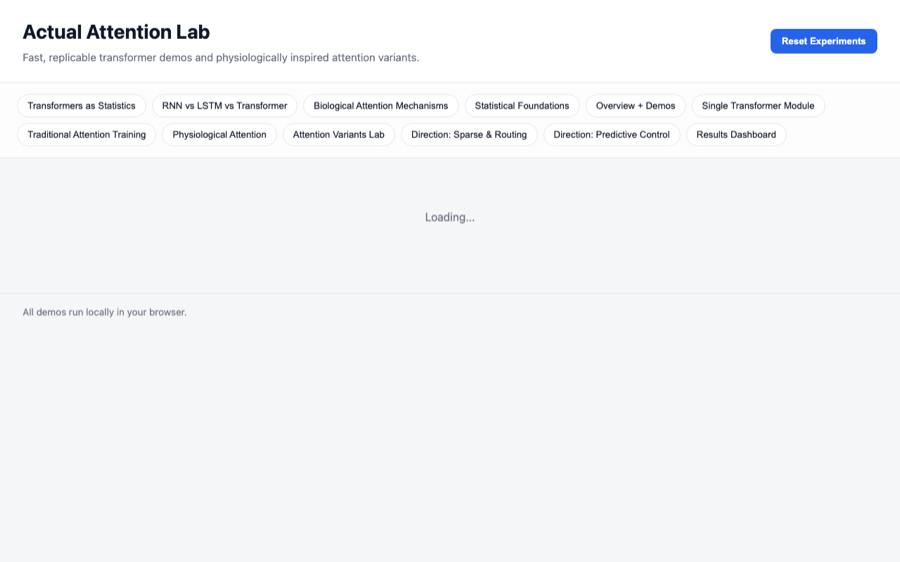

# Actual Attention Lab


🚀 **[Live Demo](https://kylemath.github.io/actualAttention)** 🚀
Fast, replicable transformer demos and physiologically-inspired attention variants.

## Overview

This project explores transformer attention mechanisms and compares them with biologically-inspired attention models based on neural recordings and cognitive neuroscience research.

## Paper: Biological Attention Mechanisms Across Neural Architectures

See **[paper/](paper/)** for our research paper comparing biological attention mechanisms across RNN, LSTM, and Transformer architectures.

**Key Finding**: Transformers benefit most from biological attention mechanisms because they preserve pairwise relationships (lossless covariance), while RNNs/LSTMs compress information into fixed-size states (sequential compression).

```bash
cd paper
make setup && make experiments && make figures && make paper
# Output: paper/tex/main.pdf
```

## Features

- **Statistical Foundations Tab**: Explore attention through covariance, eigendecomposition, SVD, and variance analysis
- **Interactive Architecture Diagram**: Visual flow from input tokens through Q/K/V projections to attention weights
- **Step-by-Step Module Demo**: Walk through transformer attention computation stages
- **Traditional Attention Training**: Standard transformer attention with configurable temperature
- **Physiological Attention**: Biased competition, lateral inhibition, tuning sharpening, noise correlation
- **Attention Variants**: Sparse routing, predictive control, and other mechanisms
- **Results Dashboard**: Compare training loss with color-coded legend and variance tracking
- **Real-time Feedback**: Toast notifications when experiments are logged
- **Variance Accountability**: Every logged run shows top eigenvalue variance (ensure variants don't lose signal)

## Quick Start

1. Open `index.html` in a web browser
2. Navigate through tabs to explore different attention mechanisms
3. Adjust sliders to see real-time effects on attention weights
4. Run training experiments and compare results in the Results Dashboard

## Architecture

- `index.html` - Main entry point with tab navigation
- `styles.css` - Unified styling for all components
- `app.js` - Core logic: attention computation, training, visualization
- `tabs/*.html` - Individual tab content (loaded dynamically)

## Tabs Explained

1. **Transformers as Statistics**: Complete comparison to classical methods (SVD, PCA, kernel methods, stepwise regression); encoder/decoder/encoder-decoder architectures; computational complexity and gradient flow analysis
2. **Statistical Foundations**: Attention as covariance, eigendecomposition, SVD, and variance routing
3. **Overview + Demos**: Why transformer "attention" is a misnomer; interactive demos showing attention as routing
4. **Single Transformer Module**: Step-by-step walkthrough of Q/K/V → Scores → Softmax → Weights
5. **Traditional Attention Training**: Baseline transformer attention with image generation
6. **Physiological Attention**: Biologically-inspired mechanisms (competition, inhibition, sharpening)
7. **Attention Variants Lab**: Explore sparse attention, lateral inhibition, and other variants
8. **Direction 1: Sparse & Routing**: Top-K sparse attention and routing efficiency
9. **Direction 2: Predictive Control**: Preparatory signals and anticipatory attention
10. **Results Dashboard**: Side-by-side comparison with legend and variance tracking

## Key Insights

### Transformers as Statistical Operations
- **Core Algorithm Distilled**: Transformers = learned projections + similarity matrix + softmax normalization + weighted aggregation
- **vs. SVD**: SVD is closed-form, unsupervised, static; transformers are learned, task-driven, data-dependent
- **vs. PCA/Eigendecomp**: PCA maximizes variance; transformers optimize task loss with learned similarity metrics
- **vs. Kernel Methods**: Attention = adaptive learned kernel (vs. fixed RBF/polynomial); Q·K^T is a gram matrix
- **vs. Stepwise Regression**: Regression uses hard feature selection; attention uses soft differentiable selection (softmax)
- **Computational Flavor**: Non-convex optimization, quadratic in sequence length (O(N²d)), differentiable routing, compositional depth
- **Three Architectures**: Encoder-only (bidirectional, best for classification), Decoder-only (causal, best for generation), Encoder-Decoder (seq2seq tasks)
- **Training Efficiency**: Parallelizable (vs. RNNs), residual connections prevent vanishing gradients, layer norm stabilizes, Adam/AdamW standard
- **Where Variants Fit**: Our bio-inspired mechanisms modify rank, sparsity, correlation structure—each has measurable impact on gradients and variance

### Statistical Foundations
- **Q·K^T as Covariance**: The attention score matrix is geometrically similar to a covariance/gram matrix
- **Eigenvalue Decomposition**: Reveals how variance is distributed across "modes" of token mixing
- **SVD Perspective**: Attention can be viewed as a low-rank approximation; singular values show information flow
- **Variance Accountability**: Traditional transformers are variance-preserving (full-rank); track cumulative variance explained to ensure variants don't lose signal
- **Correlation vs. Softmax**: Why softmax (positive, normalized, differentiable) beats correlation for neural routing

### Why "Attention" is a Misnomer
- Transformer attention is **routing**, not **selection**
- Every output is a weighted mixture of all values
- No winner-take-all, no inhibition—just soft blending
- Temperature controls sharpness, not focus in the cognitive sense

### Physiological Attention Mechanisms
Based on neural recordings and cognitive neuroscience:
- **Biased Competition**: Top-down signals bias competition between stimuli
- **Lateral Inhibition**: Suppression of neighboring/competing features
- **Tuning Sharpening**: Enhanced selectivity of neural responses
- **Noise Correlation**: Shared variability reduction during attention
- **Preparatory Control**: Pre-stimulus biasing (e.g., Posner cueing)
- **Hemineglect**: Distinction between endogenous (voluntary) and exogenous (stimulus-driven) attention

## Technical Details

- All training runs deterministically from seeds
- Toy models: 3 tokens × 2 dimensions for fast iteration
- Loss objective: focus token 0 on token 2
- Image generation: attention weights → 3×3 grayscale tiles
- Results stored in `localStorage` for session persistence

## Future Directions

- Scale to larger models with real datasets
- Implement full diffusion models with custom attention
- Add more physiological mechanisms (e.g., feature-based attention, object-based attention)
- Quantitative comparison metrics (speed, convergence, generalization)
- Export experiment results to CSV/JSON

## References

- Biased Competition Theory (Desimone & Duncan, 1995)
- Feature Integration Theory (Treisman & Gelade, 1980)
- Attention and Performance (Posner, 1980)
- Hemineglect and Spatial Attention (Corbetta & Shulman, 2002)
- Transformer Attention (Vaswani et al., 2017)

## License

Open source - feel free to explore, modify, and extend!

## Preview

<p align="center">
  
</p>
